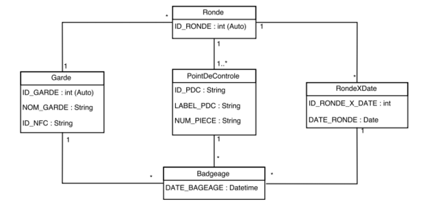
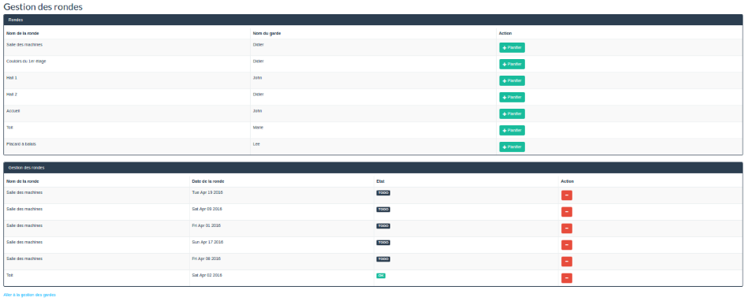
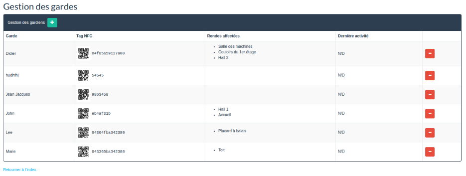
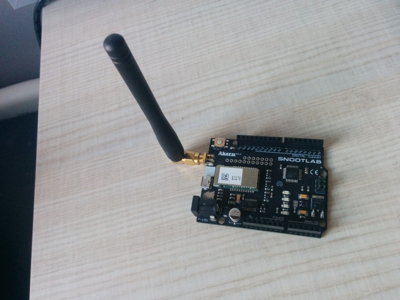
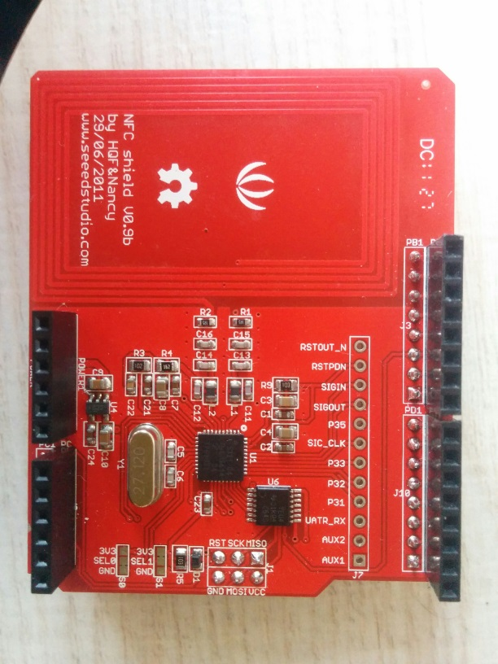
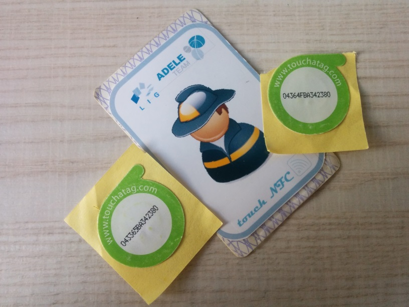

# Projet M2M SigFox

### Dependencies

For the Akeru you need to use a the Arduino IDE and the following libraries
* Adafruit_PN532
* Akeru

On the server side you will need nodejs and npm installed. 

### Usage
For the NFC tag part, just plug-in the Akeru to a power source and pass the NFC tag.
For the server side part, set up the database using the script in <code>/scripts/init.sql</code> (optionaly, you can add some dummy data with the script <code>/scripts/data.sql</code>), then go to the <code>/rondes</code> directory, and execute the following commands:
```
npm install
npm start
```

Your server is up and listenting at port 3000.

For the SigFox back-end part, you need to set up a callback URL using your server's URL.

###Cahier des charges

####Résumé
Le but de l’application est de permettre la gestion des rondes de gardiens. Cette dernière permettra d’avoir une tracabilité de chaque ronde de chaque gardiens avec identification par badge NFC.
####Description de l’application
L’application sera découpée en deux parties
*Partie I : Gestion du badgeage et de l’envoi des informations
*Partie II :  Gestion du réseau de point de badgeage (back-end).
####Badgeage du gardien
Le gardien doit badger à chaque point de contrôle, ensuite les données sont transmises au back-end SigFox puis à l’application via le callback. Chaque gardien à une rond à effectuer, la ronde est validée une fois que le gardien a badgé à tous les points de contrôle.

####Application
Une fois que l’application reçoit les données du badgeage, elle enregistre en DB le lieu (identifié par l’ID du nfc shield) et le gardien qui à badgé (identifié par l’id de son badge). Ensuite la personne chargée de gérer les rondes pourra vérifier que chaque gardien est bien passé à chaque point de contrôle de sa ronde.

###Matériels utilisés

Pour le matériel nous avons utilisé une carte Akeru (comminiquant avec le back-end Sigfox), sur laquelle nous avons pluggé un shield NFC. Pour le badgeage nous avons utilisé des badges NFC.

###Technologies utilisées

Pour toute la partie embarquée sur la carte nous avons utilisé du C++ avec la librairie Arduino Akero.

Pour le serveur Web nous avons utilisé node.js.

Pour la partie front-end nous avons utilisé Jade et Bootstrap.

###Architechture de l’application


Le tag NFC du gardien est passé sur le sheild NFC qui lui est relié à la carte Akeru (ces deux derniers représentent un point de contrôle). La carte Akeru transmet l’identifiant du tag NFC au back-end SigFox en utilisant le LPWAN, ce qui le limite à 140 messages de 12 octets maximum par jour.

Le back-end SigFox effectue ensuite un callback sur un lien d’API ouvert sur l’application de gestion des rondes qui est hébérgée sur Amazon EC2.

Les contraintes d’Amazon EC2 obligent à changer d’adresse IP (et donc d’URL de Callback) à chaque redémarrage de l’instance.

La carte Akeru doit quant à elle être branchée à une source d'énergie que ce soit via un câble d’alimentation ou via le câble USB.


###Détails de l’application
####Badgeage NFC
L’identifiant du tag NFC est lu grâce au sheild NFC et à la bibliothèque Arduino nommée “Adafruit_PN532”.

Une fois cet identifiant lu, il est transformé en hexadécimal, avant de passer à la partie suivante qui est l’envoi vers le back-end SigFox.
Transmission des données avec SigFox
Les données sont transmises au back-end SigFox en utilisant la bibliothèque Arduino nommée “Akeru”.

Il suffit donc d’envoyer les données (identifiant du tag NFC) via la méthode “send” proposée par cette librairie.

Une fois les données reçues par le back-end SigFox, un callback vers l’application de gestion des rondes hébergée sur l’isntance Amazon EC2 est automatiquement déclenchée.

####Transmission des données avec SigFox
Les données sont transmises au back-end SigFox en utilisant la bibliothèque Arduino nommée “Akeru”.

Il suffit donc d’envoyer les données (identifiant du tag NFC) via la méthode “send” proposée par cette librairie.

Une fois les données reçues par le back-end SigFox, un callback vers l’application de gestion des rondes hébergée sur l’isntance Amazon EC2 est automatiquement déclenchée.
####Gestion des rondes
#####Modèle de données


Le callback reçu depuis le back-end SigFox va vérifier que les données reçus sont cohérentes, c’est-à-dire que l’identifiant du tag NFC existe bien en base et est affecté à un garde, l’identifiant de la carte Akeru (qui représente un point un contrôle) existe bien en base, et insère une ligne dans la table “Badgeage” en faisant correspondre le point de contrôle et la date du jour.

#####Interface graphique
L’application web est composée de deux écrans, un premier écran de gestion des rondes (qui sert également de page d’accueil) et un écran de gestion des gardes.

######Écran de gestion des rondes



L’écran de gestion des rondes est composé de deux tableaux. Le premier tableau présente les rondes disponibles ainsi que le gardien affecté à chaque ronde. Pour chaque ronde il est possible de la planifier à l’aide du bouton du bouton prévu à cette effet. Une fois planifier la ronde apparaît dans le tableau suivant qui permet de gérer la planification des rondes. Ce dernier est la liste des rondes planifiée avec leur état (OK si la ronde est terminée pour que le gestionnaire puisse voir rapidement l’état de chaque ronde).
En bas de l’écran un liens permet d'accéder à l’écran de gestion des gardes.

######Écran de gestion des gardes



L’écran de gestion des gardes est composé d’un tableau listant la totalité des gardes existants. L’en-tête du tableau comporte un bouton ajouter qui permets d’ajouter un garde. Chaque ligne du tableau résume les informations d’un garde (nom, tag NFC, rondes affectées et la dernières activités). Pour chaque garde il est également possible de le supprimer à l’aide du bouton “-” présent pour chaque garde.
En bas de l’écran un liens permet le retour vers l’écran de gestion des rondes.

###Conclusion
Pour conclure notre application reprend les fonctionnalités de bases nécessaire à son fonctionnement. Cependant nous aurions aimé pouvoir testé avec plusieurs points de contrôles afin de tester de façon plus complète son fonctionnement et pouvoir l’améliorer. Pour la suite nous envisageons de développer plus de fonctionnalités pour l’application web (ajout et modification d’une ronde, modification d’un garde ainsi qu’une partie de reporting) et également revoir l’interface graphique qui actuellement est fonctionnelle mais qui peut être améliorée.

###Photos





