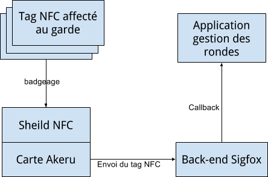

# Projet M2M SigFox

### Dependencies

For the Akeru you need to use a the Arduino IDE and the following libraries
* Adafruit_PN532
* Akeru

On the server side you will need nodejs and npm installed. 

### Usage
For the NFC tag part, just plug-in the Akeru to a power source and pass the NFC tag.
For the server side part, set up the database using the script in <code>/scripts/init.sql</code> (optionaly, you can add some dummy data with the script <code>/scripts/data.sql</code>), then go to the <code>/rondes</code> directory, and execute the following commands:
```
npm install
npm start
```

Your server is up and listenting at port 3000.

For the SigFox back-end part, you need to set up a callback URL using your server's URL.

## Architechture de l’application


Le tag NFC du gardien est passé sur le sheild NFC qui lui est relié à la carte Akeru (ces deux derniers représentent un point de contrôle). La carte Akeru transmet l’identifiant du tag NFC au back-end SigFox en utilisant le LPWAN, ce qui le limite à 140 messages de 12 octets maximum par jour.

Le back-end SigFox effectue ensuite un callback sur un lien d’API ouvert sur l’application de gestion des rondes qui est hébérgée sur Amazon EC2.

Les contraintes d’Amazon EC2 obligent à changer d’adresse IP (et donc d’URL de Callback) à chaque redémarrage de l’instance.

La carte Akeru doit quant à elle être branchée à une source d'énergie que ce soit via un câble d’alimentation ou via le câble USB.
